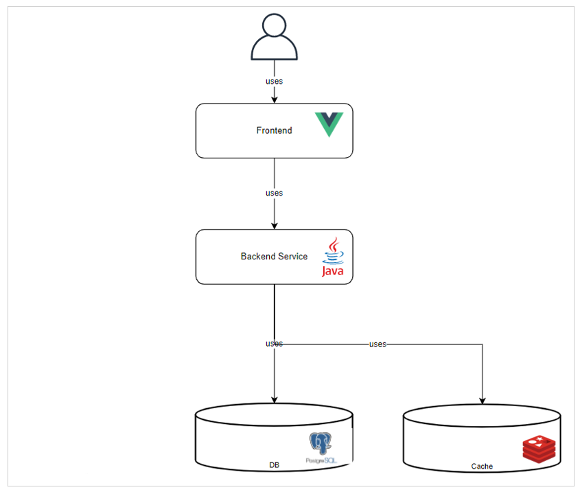
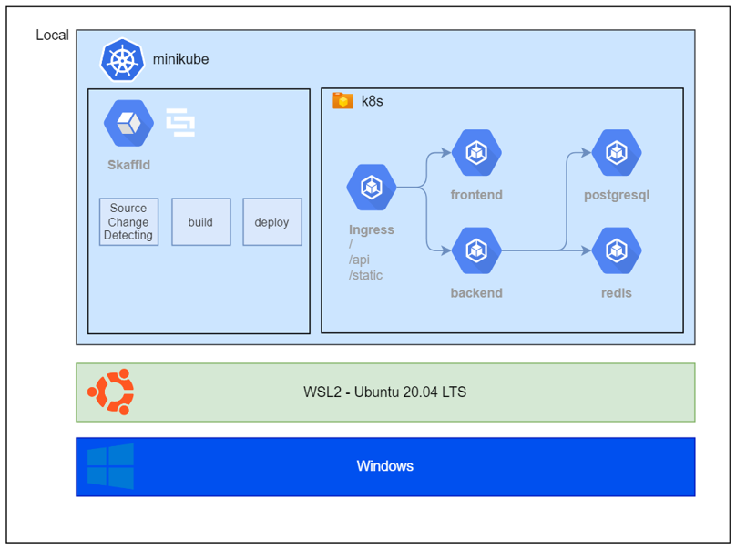

# eshop legacy 구조도



<br>



<br>

# eshop 화면


<br>

# eshop legacy 환경 실습

`compose.yaml` 파일의 변수 내용을 개인 환경에 맞게 치환하고, `docker compose up` 또는 `docker compose up -d` 로 실행

<br>

## compose.yaml 치환

아래 23번째, 32번째 라인 <<변수>>부분은 개인 환경에 맞게 수정 필요

```bash
(...생략...)
23    image: <<개인 Backend Image Registry URI>>:<<개인 Backend Image Tag>>
(...생략...)
32    image: <<개인 Frontend Image Registry URI>>:<<개인 Frontend Image Tag>>
(...생략...)
```